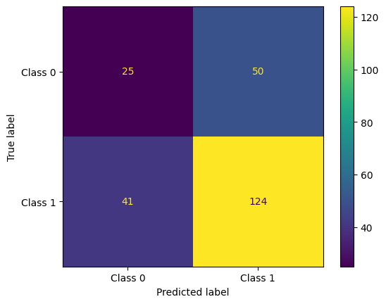

## VGT ETF Price Predictor

Analyze VGT-related news and fine-tune a FinBERT classifier to predict up/down direction.

### 1) Prepare and pre-process data
    
+ News data:
  - Utilizes the newsapi.org api to obtain VGT stock related news articles
  - Textblob is used to clean and preprocess the text data

+ Stock data:
    - The yfinance module is used to get past stock data


`prepare_dataset.py` parses the news and stock data and makes a json file that contains the text data for each day in the following format.
```
[
  {
    "date": "2026-02-28",
    "percentage_increase": 2.5,
    "articles": ["Text1", "Text2"]
  },
]
```

### 2) Build article-level split dataset

```bash
python src/build_bert_splits.py --input data/news_with_percentage.json --output-dir data/bert_dataset
```

This creates:
- `data/split_dataset/train.csv`
- `data/split_dataset/test.csv`
- `data/split_dataset/validate.csv`

with a 70:15:15 ratio respectively.


### 3) Fine-tune BERT model

The train_bert.ipynb notebook fine-tune's the finBert model by setting training arguments and hyperparameters

The trained model can be found at /models/VGT_predict_finBert


### 4) Results


| Sample Text                                                                 | Result         |              Score |
| --------------------------------------------------------------------------- | -------------- | -----------------: |
| "The stock price of VGT is expected to increase by 5% in the next quarter." | price increase |  0.848451554775238 |
| "The stock price of nvidia is expected to fall by 5% in the next quarter."  | price decrease | 0.7302989363670349 |

....ok this isn't the best model in the world, but it will be improved with future updates.

eval_f1: 0.7315634218289085

| Class        | Precision | Recall | F1-score | Support |
| ------------ | --------: | -----: | -------: | ------: |
| 0            |      0.38 |   0.33 |     0.35 |      75 |
| 1            |      0.71 |   0.75 |     0.73 |     165 |
| accuracy     |           |        |     0.62 |     240 |
| macro avg    |      0.55 |   0.54 |     0.54 |     240 |
| weighted avg |      0.61 |   0.62 |     0.61 |     240 |





### 5) Future improvments

- Improve hyperparameter tuning with Optuna
- Since the current model is very biased to predict class 1, improve the class imbalance with oversampling or weighted loss functions.
- Add custom layers with PyTorch neural networks